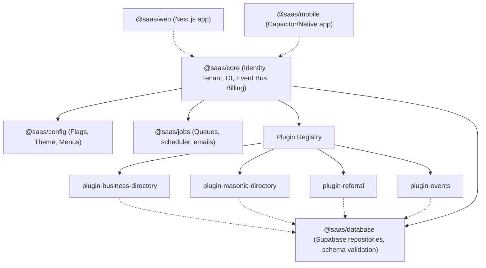

# Product Vision: Community Core Platform

The **Community Core Platform** is a modular, multi-tenant SaaS architecture designed to empower structured, member-driven organizations (communities, professional associations, clubs, masonic bodies, and local networks) with a modern digital workspace.

---

## 1. Core Mission

To provide a robust, extensible core platform that coordinates user identity, multi-tenant context, and monetization, allowing highly specialized business modules (plugins) to be hot-swapped or customized per community.

Instead of developing a monolithic app tailored to a single niche, this platform serves as a general-purpose **Community OS**.

---

## 2. Niche Targeting Strategy

- **Initial Launch Profile**: Masonic directories and portals. This profile utilizes the directory, membership lists, scheduling of private events, and billing subscriptions.
- **Immediate Commercial Expansion**: Local chambers of commerce, trade associations, and referral network clubs. Because the system is structured as independent plugins, the Maçonaria-specific attributes (rites, masonic lodges, masonic ranks) reside in a separate plugin, leaving the Core clean and ready to launch in other niches without code changes.

---

## 3. High-Level Architecture Overview

---

## 4. Key Value Propositions

- **Modular Hot-Swapping**: A tenant can toggle plugins in their portal settings instantly (e.g., turning on/off features like `business-directory` or `referral`).
- **Data Isolation**: Using PostgreSQL Row-Level Security (RLS) policies, all tenant records are cryptographically/contextually isolated at the database engine level.
- **Cross-Platform Delivery**: The platform is written once as a modern monorepo and compiled into desktop-friendly responsive web and performance-optimized mobile apps via Capacitor.
