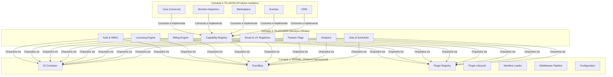
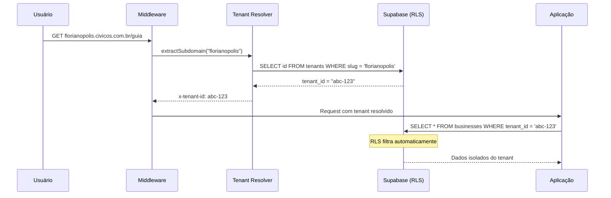
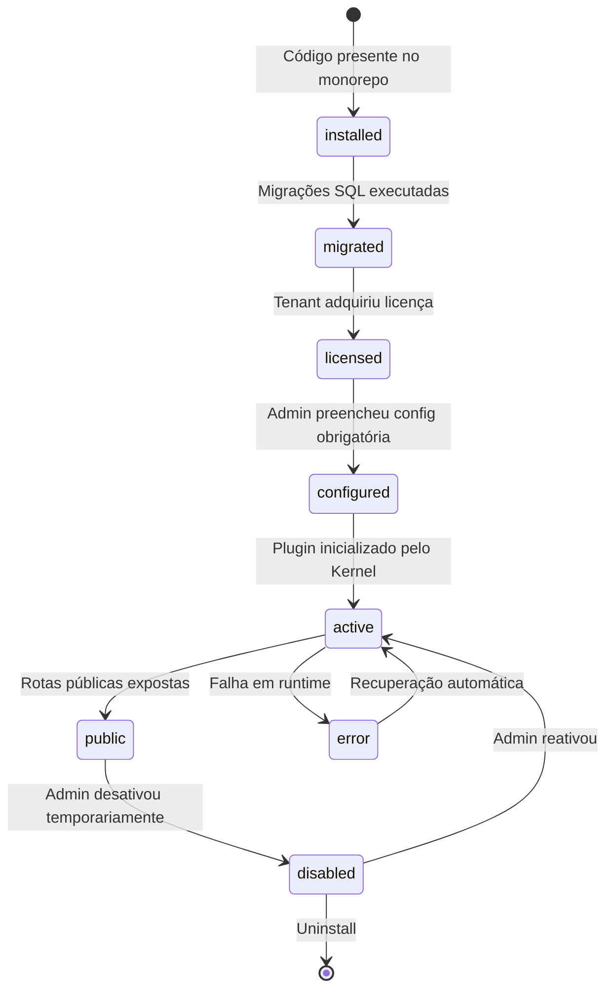
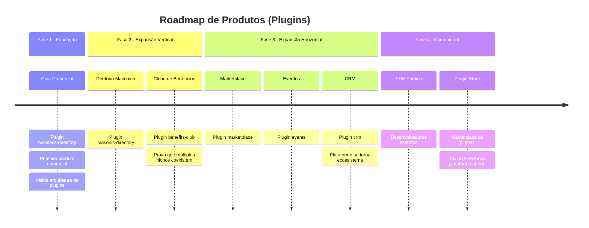

# System Master Specification — CivicOS

> _A constituição da plataforma. Toda decisão de código deve ser rastreável a
> um princípio declarado neste documento._

**Versão:** 1.0.0
**Status:** Ratificado
**Última Revisão:** 2026-07-16

---

## 1. Missão

O **CivicOS** é um framework SaaS Operating System projetado para comunidades
estruturadas — associações comerciais, diretórios profissionais, clubes de
benefícios, entidades maçônicas e redes de cooperação local.

Ele não é uma aplicação. Ele é o **sistema operacional** sobre o qual aplicações
(plugins) são construídas, instaladas, licenciadas e compostas dinamicamente
para cada inquilino (tenant).

---

## 2. Topologia de Camadas



**Regra de Dependência:** As setas apontam estritamente de cima para baixo.
Nenhuma camada inferior pode importar ou referenciar uma camada superior.

```
Plugins   → conhecem Platform e Kernel (via contratos)
Platform  → conhece Kernel (via contratos)
Kernel    → não conhece ninguém acima
```

---

## 3. As 7 Invariantes do Sistema

Estas são as leis invioláveis do CivicOS. Qualquer código que viole uma dessas
invariantes deve ser rejeitado, independente de quem o escreveu.

### Invariante 1: Kernel é Domain-Oblivious
O Kernel não contém, importa ou referencia nenhuma entidade de domínio de
negócio. Ele opera exclusivamente sobre abstrações universais: `Entity`,
`Schema`, `Plugin`, `Route`, `Event`, `Command`, `Permission`.

**Referência:** ADR-011, ADR-023

### Invariante 2: Plugins Nunca Importam Plugins
Um plugin não pode ter dependência direta (import) de outro plugin. Toda
comunicação inter-plugin acontece via EventBus ou resolução de serviços no
DI Container.

**Referência:** ADR-003, Princípio 2

### Invariante 3: Platform Não Conhece Entidades de Domínio
Serviços da Platform (Auth, Billing, Licensing) nunca referenciam conceitos
específicos como "Empresa", "Loja", "Evento". Eles operam sobre abstrações:
"Entidade", "Recurso", "Módulo", "Capability".

**Referência:** ADR-005, ADR-023

### Invariante 4: Todo Dado Respeita RLS por `tenant_id`
Toda tabela do banco de dados que contém dados multi-tenant possui:
- Uma coluna `tenant_id UUID REFERENCES tenants(id)`
- Uma política RLS ativa que filtra por `tenant_id`
- Índice na coluna `tenant_id`

**Referência:** ADR-002, Princípio 4

### Invariante 5: Toda Rota Pública Passa pelo Route Registry
Nenhuma rota pública pode existir hardcoded no diretório `app/` do Next.js sem
estar registrada no Route Registry de um plugin. O Middleware consulta o Route
Registry para validar permissões antes de renderizar.

**Referência:** ADR-029

### Invariante 6: Toda Funcionalidade Vendável é uma Capability
Se uma funcionalidade pode ser ligada, desligada, vendida como add-on ou
diferenciada entre planos, ela **deve** ser modelada como uma Capability no
catálogo oficial (`04_CAPABILITY_CATALOG.md`).

**Referência:** ADR-028

### Invariante 7: Todo Estado de Plugin Segue a State Machine
Plugins transitam por estados definidos (`installed` → `migrated` → `licensed`
→ `configured` → `active` → `public`). Nenhum plugin pode pular estados.

**Referência:** ADR-026

---

## 4. Modelo de Multi-Tenancy



**Estratégias de resolução de tenant (em ordem de prioridade):**
1. Subdomínio HTTP (`florianopolis.civicos.com.br`)
2. Header customizado (`x-tenant-id`)
3. Cookie (`tenant_id`)
4. Fallback de desenvolvimento (`florianopolis` em localhost)

---

## 5. Ciclo de Vida do Plugin



**Regras de transição:**
- Não é possível pular de `installed` para `active`
- `public` requer que todas as capabilities `requires` estejam satisfeitas
- `disabled` preserva dados — é reversível
- `error` dispara notificação ao admin do tenant

---

## 6. Estratégia de Expansão



---

## 7. Stack Tecnológico

| Camada | Tecnologia | Justificativa |
|---|---|---|
| **Runtime** | Node.js 20+ | LTS, performance, ecossistema |
| **Framework Web** | Next.js 15 (App Router) | SSR, RSC, Edge Runtime |
| **Linguagem** | TypeScript (strict mode) | Type-safety para DI e contratos |
| **Banco de Dados** | PostgreSQL via Supabase | RLS nativo, Auth integrado, Realtime |
| **Monorepo** | Turborepo + pnpm | Cache, builds paralelos, workspaces |
| **Mobile** | Capacitor | PWA → nativo sem reescrever |
| **Testes** | Vitest | Rápido, TypeScript nativo |
| **CI/CD** | GitHub Actions | Integração com monorepo |

---

## 8. Glossário Oficial

| Termo | Definição |
|---|---|
| **Kernel** | Camada mais baixa. Sistema operacional do CivicOS. Nunca contém lógica de negócio. |
| **Platform** | Serviços oficiais transversais (Auth, Billing, Licensing). Utiliza o Kernel. |
| **Plugin** | Produto isolado. Encapsula um domínio de negócio completo. |
| **Capability** | Unidade atômica de funcionalidade vendável, ligável ou composta. |
| **Registry** | Catálogo em memória onde plugins registram extensões. |
| **Extension Point** | Local oficial no Core onde plugins podem se encaixar (slot, hook). |
| **Manifest** | Conjunto de arquivos JSON declarativos que descrevem um plugin. |
| **Tenant** | Inquilino. Uma instância isolada da plataforma com seus dados e configurações. |
| **Capability Pack** | Pacote comercial que agrupa capabilities para venda. |
| **Slot** | Ponto nomeado na UI onde widgets de plugins são renderizados. |
| **State Machine** | Autômato finito que controla os estados do ciclo de vida de um plugin. |
