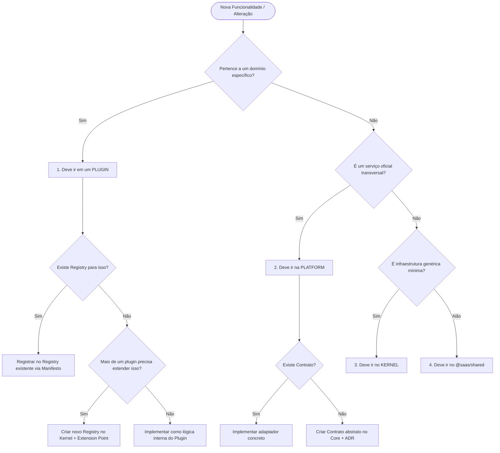

# Fluxo de Decisão (Decision Flow) — CivicOS

> _Toda IA e desenvolvedor humano deve seguir este fluxo lógico de decisão antes
> de planejar, aprovar ou escrever qualquer linha de código no CivicOS._

**Versão:** 1.0.0
**Status:** Ratificado

---

## 1. Diagrama de Fluxo Principal

---

## 2. Exemplos de Caminhos Práticos

### Caso A: Adicionar um carrossel de fotos para anúncios de empresas
1. *Pertence a um domínio específico?* **Sim (Guia Comercial)** ➜ Deve ir no Plugin `business-directory`.
2. *Existe Registry para isso?* **Sim (WidgetRegistry / ExtensionPointRegistry)**.
3. *Ação:* Adicionar o carrossel em `src/widgets/BannerCarousel` e declará-lo em `manifest/widgets.json` no slot `HOME_TOP_BANNER`.

---

### Caso B: Enviar mensagens automáticas pelo WhatsApp
1. *Pertence a um domínio específico?* **Não (Qualquer plugin pode querer enviar WhatsApp)**.
2. *É um serviço oficial transversal?* **Sim** ➜ Deve ir na PLATFORM.
3. *Existe Contrato?* **Não**.
4. *Ação:* Criar o token e contrato `INotificationChannel` no Core (Platform) e criar a implementação concreta do canal no `@saas/notifications` consumindo a API de gateway.

---

### Caso C: Injetar um serviço de Geolocalização
1. *Pertence a um domínio específico?* **Não**.
2. *É um serviço oficial transversal?* **Sim**.
3. *Existe Contrato?* **Sim (GeolocationAdapter em platform-adapter.ts)**.
4. *Ação:* Registrar e injetar a implementação concreta via DI Container no bootstrap.
