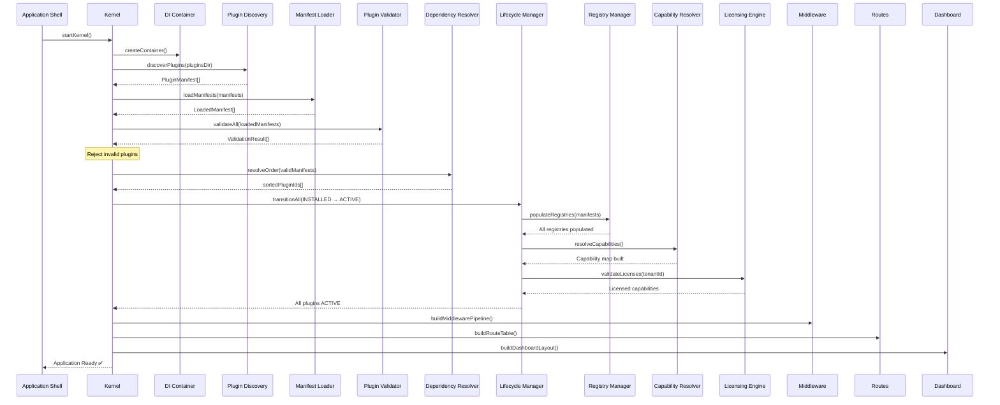

# Especificação do Boot Runtime — CivicOS

> _Define o fluxo de inicialização oficial do SaaS OS. Todo ambiente (web,
> mobile, desktop, CLI) deve respeitar esta sequência. Nenhum passo pode ser
> pulado ou reordenado._

**Versão:** 1.0.0
**Status:** Ratificado

---

## 1. Sequência de Boot

---

## 2. Fases do Boot (Detalhamento)

### Fase 1: Kernel Init
1. Instanciar o `Container` (DI)
2. Registrar tokens de serviço do Kernel (`EVENT_BUS`, `PLUGIN_REGISTRY`)
3. Carregar configuração de ambiente (`env`, `config`)

### Fase 2: Plugin Discovery
4. Escanear diretório `plugins/` do monorepo
5. Ler `plugin.json` de cada plugin encontrado
6. Construir lista de `PluginManifest[]`

### Fase 3: Manifest Loading
7. Para cada plugin, carregar todos os manifestos split:
   - `capabilities.json`, `routes.json`, `navigation.json`
   - `widgets.json`, `permissions.json`, `settings.json`
   - `events.json`, `schemas.json`, `commands.json`, `jobs.json`
8. Montar objetos `LoadedManifest[]`

### Fase 4: Validation
9. Executar `PluginValidator.validate()` em cada manifesto
10. Verificar compatibilidade de `coreVersion`
11. Verificar que todas capabilities `requires` existem
12. Rejeitar plugins inválidos (log + skip)

### Fase 5: Dependency Resolution
13. Executar ordenação topológica via dependências declaradas
14. Detectar e rejeitar ciclos

### Fase 6: Lifecycle Transitions
15. Transitar cada plugin: `installed → migrated → licensed → configured → active`
16. Executar `plugin.initialize(context)` para cada plugin ativo

### Fase 7: Registry Population
17. `RegistryManager` itera sobre cada `LoadedManifest` e popula:
    - `RouteRegistry`, `CapabilityRegistry`, `NavigationRegistry`
    - `WidgetRegistry`, `PermissionRegistry`, `SettingsRegistry`
    - `SearchRegistry`, `SchemaRegistry`, `CommandRegistry`

### Fase 8: Capability Resolution
18. `CapabilityRegistry` cruza `provides` e `requires` de todos plugins
19. Garantir que não existem dependências insatisfeitas

### Fase 9: License Validation
20. `LicensingEngine` consulta o plano do Tenant
21. Filtra capabilities ativas baseado no `LICENSE_CATALOG`
22. Desabilita widgets/rotas que requerem capabilities bloqueadas

### Fase 10: Application Assembly
23. `RouteRegistry` fornece tabela de rotas para o Middleware
24. `NavigationRegistry` fornece itens de menu para o Shell
25. `WidgetRegistry` fornece componentes para o Dashboard Engine
26. **Application Ready** ✅

---

## 3. Garantias do Boot

| Garantia | Descrição |
|---|---|
| **Idempotência** | O boot pode ser executado múltiplas vezes sem efeitos colaterais |
| **Fail-Fast** | Plugin inválido é rejeitado na Fase 4, não na Fase 10 |
| **Isolamento** | Falha de um plugin não impede a inicialização dos demais |
| **Observabilidade** | Cada fase emite logs estruturados para debugging |
| **Determinismo** | A ordem de inicialização é determinística (topological sort) |
