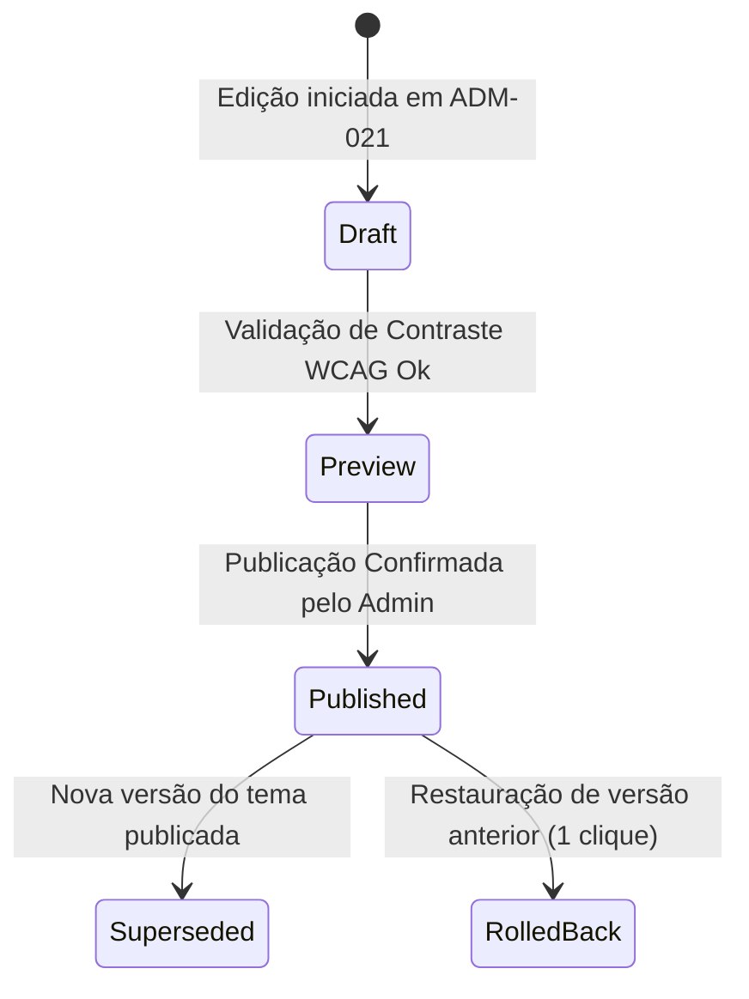

# Conexão Maçônica Theme

**Plataforma:** CivicOS / Community Framework  
**Produto Vertical:** Conexão Maçônica  
**Escopo:** Tema visual específico do produto piloto Conexão Maçônica, incluindo paleta de cores institucional com luminância progressiva (escalas 50–900), suporte nativo a Dark e Light Mode com validação de contraste WCAG 2.1 AA, ciclado de publicação do tema e governança em Tenant Admin (`ADM-021`).

---

## 1. Paleta de Cores Tonal e Escalas Oficiais

O tema da **Conexão Maçônica** combina o **Vinho / Bordô Maçônico** (cor primária institucional em `--color-primary-700: #4a0e1a`) com o **Ouro Honorífico** (cor de destaque em `--color-accent-500: #c09826`).

```css
/* Escalas Tonaiss com Luminância Progressiva */
:root {
  /* Brand Primary - Vinho / Bordô Maçônico (Progressivo) */
  --color-primary-50:  #fdf2f4;
  --color-primary-100: #fce7eb;
  --color-primary-200: #f8cdd6;
  --color-primary-300: #f19bb0;
  --color-primary-400: #e26786;
  --color-primary-500: #c23359;
  --color-primary-600: #911e3b;
  --color-primary-700: #4a0e1a; /* Cor Institucional Oficial */
  --color-primary-800: #3b0b15;
  --color-primary-900: #26070e;

  /* Accent Gold - Ouro Honorífico Maçônico */
  --color-accent-50:  #fdfbe8;
  --color-accent-100: #fbf5c5;
  --color-accent-200: #f7ea8d;
  --color-accent-300: #f1d74d;
  --color-accent-400: #d4ac38;
  --color-accent-500: #c09826; /* Cor de Destaque / Selos Oficiais */
  --color-accent-600: #9e7b1c;
  --color-accent-700: #7e5e15;
  --color-accent-800: #674b17;
  --color-accent-900: #553d17;
}
```

---

## 2. Suporte Nativo a Dark Mode (Padrão) e Light Mode (WCAG 2.1 AA)

```css
/* Dark Mode (Tema Padrão da Comunidade) */
[data-theme="dark"], :root {
  --background: #0b0f19;
  --surface: #151c2e;
  --surface-hover: #1e293b;
  --foreground: #f8fafc;
  --muted-foreground: #94a3b8;
  --border: #2a364f;

  --primary: var(--color-primary-700);
  --primary-hover: var(--color-primary-600);
  --primary-active: var(--color-primary-800);
  --primary-foreground: #ffffff;

  --accent: var(--color-accent-500);
  --accent-hover: var(--color-accent-400);
  --accent-active: var(--color-accent-600);
  --accent-foreground: #0b0f19; /* Contraste 7.08:1 sobre Ouro */

  --focus-ring: var(--color-accent-400);
  --link: var(--color-accent-400);
  --selected-bg: rgba(74, 14, 26, 0.4);
  --selected-border: var(--color-accent-500);
}

/* Light Mode (Modo Claro Institucional) */
[data-theme="light"] {
  --background: #f8fafc;
  --surface: #ffffff;
  --surface-hover: #f1f5f9;
  --foreground: #0f172a;
  --muted-foreground: #475569;
  --border: #e2e8f0;

  --primary: var(--color-primary-700);
  --primary-hover: var(--color-primary-800);
  --primary-active: var(--color-primary-900);
  --primary-foreground: #ffffff;

  --accent: var(--color-accent-500);
  --accent-hover: var(--color-accent-600);
  --accent-active: var(--color-accent-700);
  --accent-foreground: #0b0f19; /* Corrigido: Texto escuro sobre Ouro (Contraste 4.82:1) */

  --focus-ring: var(--color-primary-700);
  --link: var(--color-primary-700);
  --selected-bg: var(--color-primary-50);
  --selected-border: var(--color-primary-700);
}
```

---

## 3. Estados de Publicação do Tema (`ADM-021`)

As alterações visuais de tema realizadas pelo administrador do tenant seguem obrigatoriamente a máquina de estados de publicação abaixo, impedindo que edições rascunhadas afetem o ambiente de produção antes da homologação:



1. **`draft`**: Alteração em edição no formulário do admin.
2. **`preview`**: Tema aplicado no sandbox do painel de pré-visualização.
3. **`published`**: Versão ativa servida no cabeçalho do portal público.
4. **`superseded`**: Versão anterior mantida no histórico de edições.
5. **`rolled_back`**: Versão re-ativada após reversão manual de emergência.

---

## 4. Tipografia Institucional do Tema

- **Títulos (H1, H2, H3, Display)**: Font `Outfit`, sans-serif. Transmite prestígio, autoridade e solenidade.
- **Corpo de Texto, Formulários & Tabelas**: Font `Inter`, sans-serif. Alta legibilidade em relatórios e telas densas.
