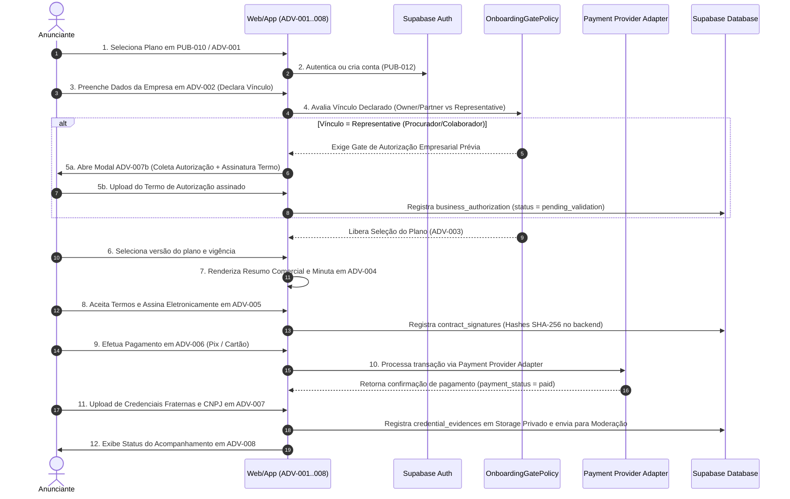
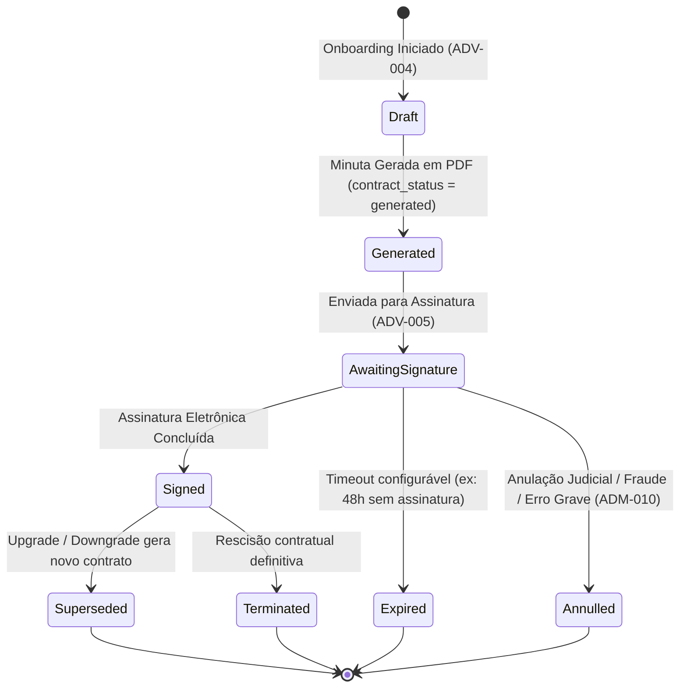
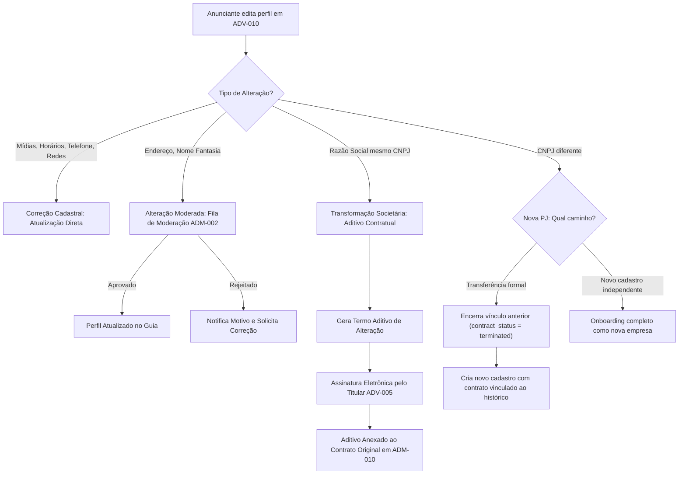

# 05 — Fluxos e Jornadas do Usuário

**Produto:** Conexão Maçônica
**Plataforma:** CivicOS / Community Framework
**Escopo:** Especificação completa dos fluxos de navegação, diagramas de sequência, diagramas de estado ortogonais (6 dimensões), regras de transição, tratamento de exceções e mapeamento das 11 jornadas do usuário sobre a matriz de 84 elementos do Documento 04

---

## 1. Objetivo e Princípios de Navegação

Este documento estabelece o mapeamento detalhado de cada clique, decisão, retorno, pré-condição e tratamento de exceção para todas as 11 jornadas funcionais do **Conexão Maçônica**, construído sobre a Fundação CivicOS e o **Community Framework**.

### 1.1 Princípios Cardinais de UX/UI
1. **Navegação Sem Beco Sem Saída (Zero Dead Ends)**: Toda tela, modal ou componente de estado (`loading`, `empty`, `error`) obrigatoriamente oferece uma ação primária clara de avanço ou retorno (ex: "Voltar para Busca", "Tentar Novamente", "Falar com Suporte").
2. **Preservação de Estado e Rascunho com Classificação de Sensibilidade**:
   - **Navegação e Filtros de UI**: Armazenados em estado temporário de sessão no navegador.
   - **Dados Pessoais, Empresariais e Jurídicos**: Persistidos com segurança no backend Supabase (`draft` state no banco com RLS), **NUNCA em armazenamento cliente não seguro**.
   - **Documentos e Comprovantes**: Armazenados em buckets privados com assinaturas temporárias (`signed URLs`).
   - **Tokens e Segredos**: Mantidos estritamente em cookies `HTTP-Only` e Auth Context Supabase.
3. **Resolução Transparente de Permissões (RBAC Feedback)**: Caso um usuário tente acessar uma funcionalidade para a qual não possui permissão, a aplicação renderiza o componente de estado `AUX-005 (Erro 403)` oferecendo o fluxo de solicitação de acesso elevado (`support:elevation:request` — proposta de lacuna RBAC).
4. **Experiência Híbrida Web/Mobile Flúida**: Interfaces adaptam-se dinamicamente entre navegadores desktop/mobile e o container **Capacitor (Release 1A-Mobile)**, utilizando gestos nativos (swipe back, pull-to-refresh, haptic feedback) no ambiente móvel.

---

## 2. Jornada 1: Descoberta, Busca e Nível de Confiança da Empresa

Esta jornada descreve o fluxo de navegação de um visitante ou usuário autenticado que busca empresas, serviços ou benefícios no portal público.

### 2.1 Mapeamento Passo a Passo

```text
PUB-001 (Splash/Home)
   │
   ├──> PUB-002 (Home Guia)
   │       │
   │       ├──> Busca Rápida ──> PUB-003 (Busca Lista) <──> PUB-004 (Drawer Filtros)
   │       │                          │
   │       │                          ├──> Alternar Visualização ──> PUB-005 (Mapa Essencial)
   │       │                          │                                  │
   │       │                          └──────────────────────────────────┴──> PUB-007 (Perfil Empresa)
   │       │                                                                       │
   │       └──> Diretório     ──> PUB-006 (Categorias) ───────────────────────────┘
   │                                                                               │
   └───────────────────────────────────────────────────────────────────────────────┴──> PUB-008 (Loja/Potência)
```

1. **Entrada (`PUB-001` / `PUB-002`)**: O usuário acessa a Home e visualiza a barra de busca central, categorias em destaque, empresas com selo de verificação e atalhos para o Mapa.
2. **Busca e Filtragem (`PUB-003` / `PUB-004`)**:
   - O usuário digita um termo ou seleciona uma categoria.
   - Ao abrir o Drawer `PUB-004`, pode filtrar por cidade, subcategoria, tipo de vínculo fraterno ("Empresa de Irmão", "Representada por Irmão"), selo de regularidade e faixa de avaliação.
3. **Alternância para Mapa Essencial (`PUB-005`)**:
   - O usuário clica no botão "Ver no Mapa". A aplicação transiciona para `PUB-005`, exibindo os pins georreferenciados das empresas aprovadas na região via `MapProviderAdapter`.
   - **Empresas sem endereço físico** (online/domiciliar): Exibem indicativo no mapa sem revelar coordenadas de residência privada.
   - Ao clicar em um marcador, exibe o Card Resumo da empresa com fotos, selos, cidade e os botões "Ver Perfil" (`PUB-007`) e "Como Chegar" (abertura do Waze/Google Maps via deep link).
4. **Visualização do Perfil (`PUB-007`)**:
   - Exibe as mídias, descrição, horários, telefone/WhatsApp direto, endereço e a **Seção de Verificação Comunitária Maçônica** (Loja de afiliação, Potência, tipo de vínculo e selos concedidos).
   - Ao clicar no nome da Loja/Potência, direciona para a página institucional da organização (`PUB-008`).

---

## 3. Jornada 2: Onboarding Comercial do Anunciante com Gates Condicionais

Esta jornada detalha a contratação de planos e o cadastro da empresa pelo empresário/anunciante, respeitando as regras de governança do `OnboardingGatePolicy`.

### 3.1 Diagrama de Sequência (Mermaid)



---

## 4. Jornada 3: Ciclo de Vida Contratual e Validação Eletrônica Opaque

Esta jornada especifica a gestão de contratos de assinatura comercial, aditivos, renovações e a validação pública por terceiros, mantendo a separação entre as 6 dimensões ortogonais de estado.

### 4.1 As 6 Dimensões Ortogonais de Estado

> **Princípio**: Cada dimensão é ortogonal e gerenciada exclusivamente pelo seu Bounded Context proprietário. `contract_status` reflete apenas a validade jurídica do instrumento; estados operacionais (ativação, suspensão, inadimplência) pertencem a `subscription_status`.

| Dimensão de Estado | Valores Possíveis | Significado | Context Owner |
|---|---|---|---|
| **`contract_status`** | `draft`, `generated`, `awaiting_signature`, `signed`, `superseded`, `expired`, `annulled`, `terminated` | Ciclo jurídico do instrumento contratual. **Não inclui estados operacionais.** | Contracts |
| **`signature_status`** | `pending_signature`, `partially_signed`, `completed`, `expired` | Progresso das assinaturas eletrônicas | Contracts |
| **`payment_status`** | `pending`, `paid`, `grace_period`, `failed`, `refunded` | Situação financeira da fatura no provedor | Billing |
| **`subscription_status`** | `pending_contract`, `pending_payment`, `pending_documents`, `under_review`, `active`, `past_due`, `suspended`, `cancelled`, `terminated`, `expired` | Situação do vínculo comercial no tenant. Inclui `suspended` (inadimplência) e `terminated` (rescisão definitiva). | Billing |
| **`verification_status`** | `unverified`, `pending_review`, `approved`, `correction_requested`, `rejected` | Análise das credenciais comunitárias | Verification |
| **`publication_status`** | `draft`, `under_review`, `published`, `unpublished`, `suspended` | Visibilidade pública do anúncio no guia | Directory |

### 4.2 Diagrama de Estados do Contrato Comercial (Mermaid)

> O diagrama abaixo reflete exclusivamente o ciclo **jurídico** do contrato. A ativação comercial (`subscription_status = active`) é consequência do evento `contracts.contract.signed.v1` processado pelo Billing Context.



> **Nota**: `Signed` é o estado terminal positivo do contrato. A transição para `active` ocorre em `subscription_status`, não em `contract_status`.

### 4.3 Fluxo de Validação Pública Mínima do Contrato (`PUB-014`)
1. Qualquer parte interessada lê o QR Code impresso no PDF do contrato assinado.
2. O navegador abre a rota opaca `/verificar-contrato/[code]` (`PUB-014`).
3. O sistema valida o código opaco `public_validation_code` no banco de dados e exibe a **Autenticidade Mínima Permitida** (preservando o sigilo de IP e User-Agent):
   - **Autenticidade**: Contrato Válido / Inválido.
   - **Número do Contrato**: Código identificador oficial.
   - **Comunidade Emissora**: Nome do Tenant (ex: Conexão Maçônica).
   - **Data da Assinatura**: Timestamp da conclusão em UTC.
   - **Status Atual**: `Active`, `Signed`, `Terminated`.
   - **Versão Documental**: Código da minuta contratual.
   - **Hash Parcial SHA-256**: Primeiros 16 caracteres do hash do documento.
4. **Resguardo de Privacidade**: Endereço IP, User-Agent, CPF completo e o pacote probatório detalhado permanecem restritos à auditoria privada em `ADM-011`.

---

## 5. Jornada 4: Moderação de Vínculos Fraternos e Gestão de Contestações

Esta jornada especifica o fluxo de moderação de afiliações comunitárias maçônicas e a resolução de contestações por terceiros.

### 5.1 Fila de Moderação de Vínculos (`ADM-003` & `ADM-003-DET`)
1. **Gatilho**: Novo cadastro de anunciante em `ADV-007` ou solicitação de vínculo em `USR-002`.
2. **Análise do Moderador (`ADM-003`)**:
   - O moderador visualiza a lista de vínculos pendentes com filtros por Loja, Potência e Oriente.
   - Ao clicar na linha, navega para a subrota `ADM-003-DET` (`/admin/vinculos/[id]`).
3. **Inspeção de Evidências em `ADM-003-DET`**:
   - Exibe a declaração do membro, comprovante de regularidade anexado em storage privado, histórico de alterações e o instrumento de autorização empresarial (`business_authorization`).
   - Ações disponíveis:
     - **Aprovar Vínculo**: Concede o selo correspondente (`credential:verify`).
     - **Solicitar Correção**: Envia notificação com pendência para o anunciante ajustar em `ADV-008`.
     - **Rejeitar Vínculo**: Notifica o usuário e desativa a exibição do selo.

### 5.2 Fluxo de Contestações de Vínculo Falso (`PUB-007b` → `ADV-009b` → `ADM-004`)

```text
Visão do Denunciante (PUB-007b)
   │  Abre modal na página da empresa, seleciona motivo (vínculo falso, irregularidade) e anexa prova
   ▼
Fila de Contestações (ADM-004)
   │  Moderador avalia admissibilidade da denúncia (masonic_link:contest:review)
   ▼
Notificação de Defesa (ADV-009b)
   │  Anunciante recebe notificação no Dashboard e abre Modal de Defesa para anexar contraprova em 5 dias úteis (masonic_link:contest:respond)
   ▼
Julgamento Administrativo (ADM-004)
   │  Moderador analisa acusação + defesa e emite parecer final:
   ├──> Mantém Vínculo: Improcedente / Arquivado
   └──> Cassação de Vínculo: Revoga selo (credential:revoke) e reclassifica a empresa no guia
```

---

## 6. Jornada 5: Experiência Móvel e Recursos Nativos (Release 1A-Mobile)

Esta jornada especifica a operação do aplicativo em ambiente móvel via container **Capacitor**, integrando recursos nativos do dispositivo.

### 6.1 Integração de Recursos Nativos no Container

| Recurso Nativo | Ponto de Uso na Aplicação | Comportamento e Fallback |
|---|---|---|
| **Geolocalização Nativa** | `PUB-005` (Mapa Essencial) | Solicita permissão `GPS_FINE`. Caso negada, utiliza filtro por Cidade selecionada manualmente. |
| **Câmera & Galeria** | `ADV-007` (Upload Docs) & `ADV-010` (Mídias) | Abre a câmera ou seletor nativo de fotos do Android/iOS para captura direta de documentos. |
| **Push Notifications** | `USR-005` & `ADM-018` | Notificações push transacionais enviadas via Firebase Cloud Messaging (FCM) / APNs. |
| **Deep Links** | E-mails e Notificações | URLs do tipo `https://conexaomaconica.com.br/empresa/[slug]` abrem diretamente no aplicativo se instalado. |
| **Biometria Opcional** | Reabertura de Sessão | TouchID / FaceID para desbloquear o Painel do Anunciante (`ADV-009`) sem re-digitar senha. |

---

## 7. Jornada 6: Renovação Automática e Ciclo Anual de Assinaturas

Esta jornada gerencia a renovação de planos comerciais ao término do ciclo de vigência, utilizando a `RenewalDocumentStrategy` configurável por tenant para determinar o nível de formalização exigido.

### 7.1 `RenewalDocumentStrategy` — Estratégias Configuráveis

| Estratégia | Quando Usar | Ação Documental | Assinatura |
|---|---|---|---|
| **`PERIOD_RECORD_ONLY`** | Renovação sem nenhuma alteração material | Apenas registra novo período em `subscription_periods`. Nenhum documento emitido. | Não |
| **`SIMPLIFIED_ACCEPTANCE`** | Alteração menor (ex: reajuste de preço) | Notificação com aceite simplificado (1 clique / checkbox). Registra `acceptance_record`. | Aceite digital simples |
| **`CONTRACT_ADDENDUM`** | Alteração material parcial (nova cláusula) | Gera termo aditivo vinculado ao contrato original. | Assinatura eletrônica |
| **`NEW_CONTRACT_VERSION`** | Mudança integral de modelo/plano | Gera novo contrato. Contrato anterior → `superseded`. | Assinatura eletrônica completa |

A seleção da estratégia é configurável por tenant via `BillingPolicy.renewalDocumentStrategy`.

### 7.2 Passo a Passo do Fluxo de Renovação

```text
30 Dias Antes (Notificação) ──> 15 Dias Antes (Minuta/Fatura conforme Strategy) ──> Data de Vencimento
                                                                                          │
   ┌──────────────────────────────────────────────────────────────────────────────────────┴──────────────────────┐
   │                                                                                                             │
   ▼ (Pagamento Confirmado)                                                                                      ▼ (Pagamento Pendente / Falha)
Vigência estendida (`subscriptions.expires_at`)                                                              Grace Period (configurável: `gracePeriodDays`)
Documento emitido conforme `RenewalDocumentStrategy`                                                             │
Histórico persistido em `subscription_periods`                                                                   ├──> Reconciliação (`ADM-012`) ──> Renovado
                                                                                                                 └──> Expirado ──> Suspensão
```

1. **`PERIOD_RECORD_ONLY`**: Sem interação do usuário. O sistema estende a vigência automaticamente após confirmação de pagamento e registra o período.
2. **`SIMPLIFIED_ACCEPTANCE`**: Notificação com banner de aceite em `ADV-011`. Um clique confirma a ciência da alteração.
3. **`CONTRACT_ADDENDUM`**: Gera aditivo em `ADV-011`, vinculado ao contrato original. Requer assinatura eletrônica em `ADV-005`.
4. **`NEW_CONTRACT_VERSION`**: Fluxo completo: novo contrato → assinatura → pagamento. Contrato anterior automaticamente marcado como `superseded`.
5. **Grace Period Configurável**: O período de carência é configurável por tenant via `BillingPolicy` (ex: `gracePeriodDays: 15`).

---

## 8. Jornada 7: Upgrade e Downgrade conforme BillingPolicy

Esta jornada especifica a migração entre planos comerciais respeitando as três estratégias de upgrade/downgrade suportadas pela `BillingPolicy` do tenant.

### 8.1 Estratégias Configuráveis de Migração

1. **`RESTART_CYCLE_FULL_CHARGE`**: Cobra o valor integral do novo plano e inicia uma nova vigência de 12 meses imediatamente.
2. **`PRORATED_DIFFERENCE`**: Calcula a diferença proporcional do valor com base nos dias restantes de vigência, cobrando apenas o valor líquido. O cálculo proporcional respeita ano bissexto (365/366 dias), regras de arredondamento monetário e valor mínimo de transação.
3. **`NEXT_RENEWAL`**: Agenda a mudança do plano (upgrade ou downgrade) para a data da próxima renovação anual (`downgrade_scheduled_at`), mantendo a vigência e cotas atuais intactas até lá.

---

## 9. Jornada 8: Cancelamento, Rescisão e Retenção por Classe de Dado

Esta jornada gerencia o encerramento da assinatura comercial, distinguindo rigorosamente **cancelamento voluntário da renovação** (não-renovação ao fim do ciclo), **suspensão administrativa** e **rescisão contratual definitiva**.

### 9.1 Distinção de Ações de Encerramento

| Ação de Encerramento | Estado Comercial Resultante | Visibilidade da Publicação | Contrato | Preservação |
|---|---|---|---|---|
| **Cancelamento da Renovação** (voluntário) | `subscription_status = active` + `cancel_at_period_end = true` + `renewal_status = cancelled` | `publication_status = published` (até expirar vigência paga) | `contract_status = signed` (inalterado até expirar) | Perfil mantido. Ao expirar: `subscription_status = expired`. |
| **Suspensão Administrativa** (inadimplência / moderação) | `subscription_status = suspended` | `publication_status = suspended` | `contract_status = signed` (inalterado) | Ocultado do guia. Reversível via reativação (Jornada 9). |
| **Rescisão Contratual Definitiva** | `subscription_status = terminated` | `publication_status = unpublished` | `contract_status = terminated` | `business_status = archived`. Irreversível sem novo contrato. |

> **Nota**: `subscription_status = cancelled` é reservado para **pós-expiração** de assinaturas que não foram renovadas, ou seja, o estado final após o período pago terminar com `cancel_at_period_end = true`. Durante a vigência ativa, o status permanece `active`.

### 9.2 Matriz de Retenção por Classe de Dado

> **`status: PROPOSED` — `approved_by: pendente_validacao_juridica_dpo`**
>
> Todos os prazos de retenção abaixo são propostas técnicas iniciais e **não possuem aprovação jurídica**. Antes da implementação, cada prazo deve ser validado pelo DPO e/ou assessoria jurídica do tenant, considerando a legislação aplicável à comunidade específica.

| Classe de Dado | Política de Retenção Proposta | Fundamento Legal Previsto | Status |
|---|---|---|---|
| **Documentos Fiscais & Pagamentos** | 5 Anos em Storage Seguro | Legislação Tributária | `PROPOSED` |
| **Contratos e Evidências de Assinatura** | 5 Anos em Storage Seguro | Prescrição de Ações Civis | `PROPOSED` |
| **Dados Cadastrais Básicos da Empresa** | Arquivado em Banco Privado (5 Anos) | Retenção para Defesa em Processos | `PROPOSED` |
| **Logs Técnicos e de Segurança** | 6 Meses a 1 Ano | Marco Civil da Internet (Art. 15) | `PROPOSED` |
| **Documentos Rejeitados / Rascunhos** | Exclusão em 90 Dias | Minimização de Dados (LGPD) | `PROPOSED` |
| **Consentimentos e Termos LGPD** | Mantidos enquanto a conta existir | Cumprimento de Obrigação Legal | `PROPOSED` |

---

## 10. Jornada 9: Recuperação e Reativação Pós-Inadimplência com Gates Multi-Dimensional

Esta jornada detalha a reativação assíncrona de um anúncio suspenso por inadimplência, exigindo a satisfação de **múltiplos gates** antes de restaurar a publicação.

### 10.1 Gates de Reativação Multi-Dimensional

> A restauração da publicação **não é automática** após pagamento. O Worker Assíncrono avalia os seguintes gates independentes. Somente quando **todos** estiverem satisfeitos a publicação é restaurada.

| Gate | Condição | Quem Verifica | Evento que Satisfaz |
|---|---|---|---|
| **`payment_gate`** | Pagamento pendente reconciliado | Billing Context | `billing.payment.approved.v1` |
| **`verification_gate`** | Credenciais comunitárias ainda válidas | Verification Context | Consulta `verification_status = approved` |
| **`moderation_gate`** | Nenhuma sanção ativa de moderação | Directory Context | Consulta `moderation_holds` vazio |
| **`publication_hold`** | Nenhum hold administrativo manual | Directory Context | Consulta `publication_holds` vazio |

### 10.2 Fluxo de Reativação Observável e Idempotente

```text
Inadimplência (Pós-Grace Period) ──> Assinatura Suspensa (`subscription_status = suspended`)
                                              │
   ┌──────────────────────────────────────────┴──────────────────────────────────────────────┐
   │                                                                                         │
   ▼ (Pagamento via Link / Pix em ADV-006)                                                   ▼ (Atendimento Manual ADM-012)
Webhook Payment Provider Adapter (`PaymentApproved`)                                      Reconciliação Manual / Abate (`financial:adjust`)
   │                                                                                         │
   └─────────────────────────────────────────┬───────────────────────────────────────────────┘
                                             ▼
                          Worker Assíncrono Idempotente
                          ├─ ✅ payment_gate: satisfeito
                          ├─ ❓ verification_gate: consulta verification_status
                          ├─ ❓ moderation_gate: consulta moderation_holds
                          └─ ❓ publication_hold: consulta publication_holds
                                             │
                          ┌──────────────────┴──────────────────┐
                          ▼ (Todos gates satisfeitos)           ▼ (Gate insatisfeito)
                  subscription_status = active           Mantém suspended
                  publication_status = published         Notifica admin (ADM-012)
```

---

## 11. Jornada 10: Alteração Cadastral Estrutural — Classificação por Natureza da Mudança

Esta jornada classifica alterações cadastrais em **3 naturezas distintas**, cada uma com fluxo jurídico e operacional próprio, evitando tratar uma mudança de CNPJ (nova pessoa jurídica) como mera edição com aditivo.

### 11.1 Classificação de Alterações Cadastrais

| Natureza da Alteração | Exemplos | Fluxo | Documento |
|---|---|---|---|
| **Correção Cadastral** | Mídias, horários, telefone, redes sociais | Atualização direta instantânea | Nenhum |
| **Alteração Moderada** | Endereço, nome fantasia | Fila de moderação (`ADM-002`). Aprovado → atualiza perfil. Rejeitado → notifica e solicita correção. | Nenhum |
| **Transformação Societária** | Razão social alterada (mesmo CNPJ), mudança de sócio majoritário | Aditivo contratual vinculado ao contrato original (`ADV-012` → `ADV-005`) | Termo aditivo |
| **Nova Pessoa Jurídica** | CNPJ diferente (fusão, cisão, novo CNPJ) | **Novo cadastro de empresa** ou **transferência formal** com encerramento do vínculo anterior e criação de novo contrato | Novo contrato |

### 11.2 Regras de Decisão



> **Nota**: A distinção entre transformação societária e nova PJ é fundamental para evitar fraude contratual (ex: transferir dívidas de um CNPJ para outro) e para preservar a auditoria do histórico de relacionamento.

---

## 12. Jornada 11: Operação da Torre de Controle Master com Tratamento de Falhas (`CTL-001` a `CTL-003-S10`)

Esta jornada especifica o fluxo do Platform Master (`master`) ao provisionar uma nova instância de comunidade (ex: Rotary Connect, CREA Network), incluindo a retomada segura pós `provisioning_failed`.

### 12.1 Isolamento Lógico e Retomada de Provisionamento

- **Isolamento**: Todo tenant opera sob **Isolamento Lógico via `tenant_id` + Row Level Security (RLS)** em banco de dados compartilhado.
- **Tratamento de Exceções e Retomada Segura (`CTL-003-S01..S10`)**:
  - **Conflito de Slug / Domínio**: O Step 03 valida a disponibilidade em tempo real no DNS e no banco. Em caso de duplicidade, bloqueia o avanço e sugere variações.
  - **Falha de Certificado HTTPS / DNS**: O Step 05 emite alerta técnico e permite prosseguir com subdomínio temporário (`tenant.civicos.com.br`) até regularização do CNAME.
  - **Retomada Segura pós `provisioning_failed`**: Caso ocorra falha no Step 10, o estado do rascunho é preservado em `provisioning_failed`. A segunda tentativa lê o rascunho existente e executa a idempotência dos recursos pendentes sem criar registros duplicados.

---

## 13. Matriz Global de Transições entre Interfaces

| Origem (ID) | Ação / Gatilho | Condição / Regra | Destino (ID) |
|---|---|---|---|
| `PUB-001` | Splash Concluído | Sessão Anônima | `PUB-002` |
| `PUB-002` | Clique "Buscar" | Campo preenchido ou categoria | `PUB-003` |
| `PUB-002` | Clique "Ver no Mapa" | Clique direto na barra de busca | `PUB-005` |
| `PUB-002` | Clique "Anunciar" | Sessão Anônima | `PUB-010` |
| `PUB-003` | Clique "Filtros" | Ação no cabeçalho de busca | `PUB-004` (Drawer) |
| `PUB-003` | Clique em Card | Seleção de empresa | `PUB-007` |
| `PUB-007` | Clique "Contestar" | Usuário Autenticado | `PUB-007b` (Modal) |
| `PUB-010` | Clique "Contratar Plano"| Seleção da tabela de preços | `ADV-001` |
| `ADV-001` | Formulário Concluído | Usuário Autenticado | `ADV-002` |
| `ADV-002` | Salva Dados Empresa | Vínculo = Owner / Partner | `ADV-003` |
| `ADV-002` | Salva Dados Empresa | Vínculo = Representative | `ADV-007b` (Modal Gate) |
| `ADV-007b`| Termo Autorização Salvo| Hash registrado no banco | `ADV-003` |
| `ADV-003` | Seleção do Plano | Plano + Vigência | `ADV-004` |
| `ADV-004` | Aceite dos Termos | Geração da Minuta | `ADV-005` |
| `ADV-005` | Assinatura Concluída | Hashes de integridade | `ADV-006` |
| `ADV-006` | Pagamento Confirmado | Retorno Payment Adapter (Paid) | `ADV-007` |
| `ADV-007` | Upload de Docs Concluído| Arquivos em Storage Supabase | `ADV-008` |
| `ADV-008` | Clique "Ir ao Painel" | Status = In Review | `ADV-009` |
| `ADV-011` | Clique "Renovar / Upgrade"| Mudança de plano ou ciclo | `ADV-003` / `ADV-006` |
| `ADV-011` | Clique "Cancelar" | Solicitação voluntária | `ADV-011` (Modal Exit) |
| `ADM-001` | Clique "Moderar Vínculos"| Perfil = Tenant Admin / Mod | `ADM-003` |
| `ADM-003` | Clique na Linha Vínculo| Perfil = Tenant Admin / Mod | `ADM-003-DET` |
| `CTL-001` | Clique "Novo Tenant" | Perfil = Platform Master | `CTL-002` → `CTL-003-S01` |

---

## 14. Prioridade e Sprint Sugerida

- **Prioridade**: P1 — Crítica.
- **Sprint Sugerida**: Sprint 1.0.8 (Especificação Completa das 11 Jornadas do Usuário).
