# Documento 09 — Plano de Sprints

**Versão:** 1.0.0
**Status:** Proposto (aguardando aprovação)
**Base:** `Doc 08 — Backlog Priorizado (Aprovado)`, `Docs 00–07 (Congelados)`, `Community Framework v1.0`
**Produto:** Conexão Maçônica
**Plataforma:** CivicOS (`foundation-v1.0`)
**Escopo:** Execução dos 90 PBIs / 385 SP em 13 sprints de 2 semanas, com duas tracks paralelas (Infra + App)

---

## 1. Objetivo

Este documento converte o **Backlog Priorizado (Doc 08)** em um **cronograma de execução em sprints**, definindo:

- Ordem de entrega respeitando a cadeia crítica de dependências (Doc 08 §7.1).
- Alocação de capacidade (velocidade realista, paralelismo Infra/App).
- Critérios de pronto por sprint e Definition of Done (DoD Global `CRIT-TRN-031`).
- Riscos de cronograma e mitigações.

---

## 2. Premissas de Capacidade

| Parâmetro | Valor |
|---|---|
| Duração da sprint | 2 semanas |
| Tamanho do time | 4 devs (2 Infra + 2 App) até o Sprint 2; depois 3 App + 1 Infra |
| Velocity nominal | 40–50 SP/sprint (time completo) |
| Velocity por track | Infra: 20–25 SP/sprint · App: 20–25 SP/sprint |
| Cadência de revisão | Review a cada sprint (demo funcional) + Retro |
| Homologação visual | Design Lab como Definition of Ready para PBIs de UI (contínuo) |

> **Aviso**: velocity é nominal. As 2 primeiras sprints (0 e 1) são dominadas pela Fundação/Infra. O plano prevê buffer de ~10% (≈35 SP) ao final (Sprint 12) para absorção de imprevistos.

---

## 3. Modelo de Execução (Tracks)

```text
Sprint 0-1: Track única (Infra domina; App prepara shell/design)
Sprint 2+:  Track A — Infra (hardening, RLS, EDA, Torre de Controle)
            Track B — App (telas, jornadas, integrações)
Sprint 7-8: Torre de Controle (1 App + 1 Infra) // MVP 1B desbloqueia
Sprint 9+:  Time concentrado em MVP 1B
```

**Gates entre fases:**
- **Gate 1 (pós Sprint 1)**: `INF-001`–`INF-006` verdes (schema migrado, RLS testada, RBAC runtime operacional, Outbox/DLQ processando). → desbloqueia track App.
- **Gate 2 (pós Sprint 6)**: MVP 1A-Core completo + rota de onboarding de ponta a ponta homologada. → desbloqueia MVP 1A-Control.
- **Gate 3 (pós Sprint 8)**: Torre de Controle operacional. → desbloqueia MVP 1B.

---

## 4. Plano de Sprints

### Sprint 0 — Fundação (Infra) — 7 PBIs / 47 SP

| PBI-ID | SP | Critério de Pronto |
|---|---|---|
| INF-001 | 8 | Schema completo migrado (Doc 02), `pnpm db:migrate:test` verde |
| INF-002 | 8 | RLS em todas as tabelas; suíte positiva + negativa + cross-tenant 100% |
| INF-003 | 8 | Outbox + DLQ + Worker; idempotência verificada; 500 events/s |
| INF-004 | 8 | Runtime RBAC (`has_tenant_role`, `has_business_permission`, sessão elevada) + unit tests |
| INF-005 | 5 | Entitlements Core CRUD + consumo testado |
| INF-006 | 5 | LGPD base (aceites com hash, consentimentos, export/revoke) |
| XS-001 | 5 | Pipeline CI/CD (`lint`, `typecheck`, `test`, `build`) verde |

> **Entrega chave**: base de dados + segurança + CI/CD prontos. **Nenhuma tela** entregue ainda.

---

### Sprint 1 — Auth & Onboarding Core — 9 PBIs / 32 SP

| PBI-ID | SP | Critério de Pronto |
|---|---|---|
| PUB-011 | 3 | Login JWT + refresh silencioso (`CRIT-TRN-001/002/003`) |
| PUB-012 | 3 | Cadastro pessoal com validação (`CRIT-VSC-003`) |
| PUB-013 | 2 | Recuperação de senha |
| USR-001 | 3 | Meu Perfil & Segurança |
| USR-002 | 5 | Meus Vínculos Comunitários |
| AUX-001 | 3 | Componentes de Estado (loading/empty/404/500/403/maintenance) |
| ADV-001 | 3 | Onboarding W1: Conta Responsável |
| ADV-002 | 5 | Onboarding W2: Dados da Empresa (rascunho + vínculo) |
| ADV-007b | 5 | Modal Autorização Empresarial (gate condicional, `CRIT-VSC-004`) |

> **Entrega chave**: autenticação funcional + primeira jornada de onboarding até o gate de autorização.

---

### Sprint 2 — Onboarding: Contratação & Pagamento — 6 PBIs / 23 SP

| PBI-ID | SP | Critério de Pronto |
|---|---|---|
| ADV-003 | 3 | Seleção do Plano (`CRIT-VSC-005`) |
| ADV-004 | 2 | Resumo Comercial |
| ADV-005 | 5 | Assinar Contrato com hash SHA-256 (`CRIT-VSC-006`, `legal.contract.signed.v1`) |
| ADV-006 | 5 | Checkout Pix/Cartão (`CRIT-VSC-007`, `billing.payment.approved.v1`) |
| ADV-007 | 5 | Upload de Docs/Vínculo (`CRIT-VSC-008`) |
| ADV-008 | 3 | Status da Análise |

> **Entrega chave**: jornada completa do anunciante (W1→W8) navegável fim-a-fim com contrato + pagamento + evidências.

---

### Sprint 3 — Área Pública I — 10 PBIs / 30 SP

| PBI-ID | SP | Critério de Pronto |
|---|---|---|
| PUB-001 | 1 | Splash |
| PUB-002 | 3 | Home do Guia (`CRIT-VSC-001`) |
| PUB-003 | 5 | Busca Global com filtros (`CRIT-VSC-001`) |
| PUB-004 | 3 | Drawer de Filtros |
| PUB-005 | 5 | Mapa Essencial (`CRIT-VSC-001`) |
| PUB-006 | 2 | Diretório de Categorias |
| PUB-007 | 5 | Perfil Público (`CRIT-VSC-002`) |
| PUB-010 | 2 | Tabela de Planos |
| PUB-014 | 3 | Validação Pública de Contrato |
| PUB-015 | 1 | Termos & Privacidade |

> **Entrega chave**: vitrine pública completa (busca, mapa, perfil, planos) consumindo empresas publicadas.

---

### Sprint 4 — Painel do Anunciante — 6 PBIs / 26 SP

| PBI-ID | SP | Critério de Pronto |
|---|---|---|
| ADV-009 | 5 | Dashboard do Anunciante (`CRIT-VSC-012`) |
| ADV-010 | 5 | Editar Perfil & Mídias |
| ADV-011 | 5 | Assinatura & Faturas (`CRIT-VSC-015`) |
| ADV-012 | 3 | Meus Contratos & Aditivos |
| USR-005 | 3 | Notificações Transacionais |
| USR-007 | 5 | Privacidade & LGPD |

> **Entrega chave**: gestão contínua do anunciante (perfil, assinatura, contratos, LGPD).

---

### Sprint 5 — Moderação & Publicação I — 7 PBIs / 33 SP

| PBI-ID | SP | Critério de Pronto |
|---|---|---|
| ADM-001 | 5 | Dashboard Administrativo Tenant |
| ADM-002 | 5 | Fila de Moderação de Empresas (`CRIT-VSC-009/010/011`) |
| ADM-003 | 5 | Moderação de Vínculos Maçônicos |
| ADM-003-DET | 5 | Detalhe & Histórico do Vínculo |
| ADM-005 | 5 | Usuários & Roles Tenant |
| ADM-006 | 5 | Lojas e Potências |
| ADM-007 | 3 | Catálogo de Categorias |

> **Entrega chave**: ciclo completo de moderação → aprovação → publicação no guia.

---

### Sprint 6 — Financeiro, Auditoria & Operação — 8 PBIs / 31 SP

| PBI-ID | SP | Critério de Pronto |
|---|---|---|
| ADM-008 | 3 | Tabela de Planos |
| ADM-009 | 5 | Assinaturas & Billing (`CRIT-VSC-015`) |
| ADM-010 | 5 | Gestão de Contratos (`CRIT-VSC-013`) |
| ADM-011 | 5 | Detalhe do Contrato & Auditoria |
| ADM-012 | 5 | Extrato & Reconciliação (`CRIT-VSC-014`) |
| ADM-018 | 2 | Central de Notificações Admin |
| ADM-020 | 3 | Trilha de Auditoria (`CRIT-TRN-015`) |
| ADM-021 | 3 | Configurações da Operação |

> **Entrega chave**: governança financeira e operacional do tenant. **Gate 2** — MVP 1A-Core completo.

---

### Sprint 7 — Torre de Controle: Base + Wizard 1–5 — 10 PBIs / 30 SP

| PBI-ID | SP | Critério de Pronto |
|---|---|---|
| CTL-001 | 3 | Dashboard Consolidado Master |
| CTL-002 | 5 | Gestão de Instâncias |
| CTL-003 | 3 | Wizard Provisionamento (main) |
| CTL-003-S01 | 2 | Step 1: Selecionar Template |
| CTL-003-S02 | 2 | Step 2: Identificação Básica |
| CTL-003-S03 | 3 | Step 3: Slug & Subdomínio |
| CTL-003-S04 | 3 | Step 4: Branding & Theme |
| CTL-003-S05 | 3 | Step 5: Domínio DNS/HTTPS |
| XS-003 | 3 | Job expurgo de rascunhos (GAP-DOC07-001) |
| XS-004 | 3 | Envelope Push padronizado (GAP-DOC07-002) |

> **Entrega chave**: Torre Master navegável + primeiros 5 passos do wizard de provisionamento.

---

### Sprint 8 — Torre de Controle: Wizard 6–10 + DLQ — 6 PBIs / 18 SP

| PBI-ID | SP | Critério de Pronto |
|---|---|---|
| CTL-003-S06 | 2 | Step 6: Habilitação Módulos |
| CTL-003-S07 | 3 | Step 7: Políticas & Gates |
| CTL-003-S08 | 3 | Step 8: Billing & Gateway |
| CTL-003-S09 | 2 | Step 9: Admin Inicial |
| CTL-003-S10 | 3 | Step 10: Readiness & Publish |
| CTL-006 | 5 | Operações Eventos / DLQ (`CRIT-VSC-016`) |

> **Entrega chave**: provisionamento de tenant fim-a-fim + DLQ Inspector. **Gate 3** — MVP 1A-Control completo.

---

### Sprint 9 — MVP 1B: Descoberta Avançada & Cupons — 7 PBIs / 29 SP

| PBI-ID | SP | Critério de Pronto |
|---|---|---|
| PUB-005b | 5 | Mapa Avançado (Heatmap) |
| PUB-008 | 5 | Página da Loja / Potência |
| PUB-009 | 5 | Vitrine de Cupons |
| USR-003 | 3 | Meus Favoritos |
| USR-004 | 3 | Meus Cupons |
| USR-006 | 3 | Minhas Interações & Avaliações |
| ADV-014 | 5 | Gestão de Cupons da Empresa |

---

### Sprint 10 — MVP 1B: Contestações & CRM — 5 PBIs / 34 SP

| PBI-ID | SP | Critério de Pronto |
|---|---|---|
| PUB-007b | 5 | Modal de Contestação Pública |
| ADV-009b | 5 | Modal Defesa de Contestação |
| ADM-004 | 8 | Gestão de Contestações & Denúncias (`CRIT-VSC-011`) |
| ADV-013 | 8 | CRM de Leads do Anunciante |
| ADM-016 | 8 | CRM Interno de Anunciantes |

> **Entrega chave**: ciclo completo de contestações (denúncia → defesa → julgamento) + CRM de vendas.

---

### Sprint 11 — MVP 1B: Analytics & Importação — 6 PBIs / 34 SP

| PBI-ID | SP | Critério de Pronto |
|---|---|---|
| ADV-015 | 8 | Analytics & Desempenho do Anunciante |
| ADM-019 | 5 | Analytics & Desempenho Tenant |
| ADM-017 | 8 | Carga & Importação em Lote |
| ADM-013 | 5 | Cupons Globais Tenant |
| ADM-014 | 5 | Eventos Institucionais |
| ADM-015 | 3 | Conteúdo & Banners |

---

### Sprint 12 — MVP 1B: Governança Global + Buffer — 3 PBIs / 18 SP

| PBI-ID | SP | Critério de Pronto |
|---|---|---|
| CTL-004 | 8 | Catálogo & Especificação de Templates |
| CTL-005 | 5 | Governança Global de Contratos (`CRIT-VSC-013`) |
| XS-002 | 5 | Webhook de contratação para CRM externo (GAP-DOC07-003) |

> **Buffer**: 18 SP reservados nesta sprint também absorvem atrasos acumulados (≈10% do total).

---

## 5. Grafo de Dependências Macro

```mermaid
flowchart LR
    subgraph FASE1[Fundação]
        S0[Sprint 0<br/>Fundação Infra<br/>47 SP] --> S1[Sprint 1<br/>Auth + Onboarding<br/>32 SP]
    end
    subgraph FASE2[MVP 1A-Core]
        S1 --> S2[Sprint 2<br/>Contratação<br/>23 SP]
        S2 --> S3[Sprint 3<br/>Área Pública<br/>30 SP]
        S3 --> S4[Sprint 4<br/>Painel Anunciante<br/>26 SP]
        S4 --> S5[Sprint 5<br/>Moderação<br/>33 SP]
        S5 --> S6[Sprint 6<br/>Financeiro/Operação<br/>31 SP]
    end
    subgraph FASE3[MVP 1A-Control]
        S6 --> S7[Sprint 7<br/>Torre Base + Wizard 1-5<br/>30 SP]
        S7 --> S8[Sprint 8<br/>Wizard 6-10 + DLQ<br/>18 SP]
    end
    subgraph FASE4[MVP 1B]
        S8 --> S9[Sprint 9<br/>Descoberta & Cupons<br/>29 SP]
        S9 --> S10[Sprint 10<br/>Contestações & CRM<br/>34 SP]
        S10 --> S11[Sprint 11<br/>Analytics & Importação<br/>34 SP]
        S11 --> S12[Sprint 12<br/>Governança + Buffer<br/>18 SP]
    end
```



---

## 6. Consolidação do Cronograma

| Sprint | Fase | PBIs | SP | Data-alvo (relativa) |
|---|---|---|---|---|
| 0 | Fundação | 7 | 47 | Semana 1–2 |
| 1 | MVP 1A-Core | 9 | 32 | Semana 3–4 |
| 2 | MVP 1A-Core | 6 | 23 | Semana 5–6 |
| 3 | MVP 1A-Core | 10 | 30 | Semana 7–8 |
| 4 | MVP 1A-Core | 6 | 26 | Semana 9–10 |
| 5 | MVP 1A-Core | 7 | 33 | Semana 11–12 |
| 6 | MVP 1A-Core | 8 | 31 | Semana 13–14 |
| 7 | MVP 1A-Control | 10 | 30 | Semana 15–16 |
| 8 | MVP 1A-Control | 6 | 18 | Semana 17–18 |
| 9 | MVP 1B | 7 | 29 | Semana 19–20 |
| 10 | MVP 1B | 5 | 34 | Semana 21–22 |
| 11 | MVP 1B | 6 | 34 | Semana 23–24 |
| 12 | MVP 1B | 3 | 18 | Semana 25–26 |
| **Total** | — | **90** | **385** | **~26 semanas** |

---

## 7. Riscos de Cronograma e Mitigações

| Risco | Impacto | Mitigação |
|---|---|---|
| **Velocity superestimada** (NFR-003 500 RPS, testes RLS extensos) | Sprint 0–1 estouram | Buffer de 18 SP na Sprint 12; revisão de velocity após Sprint 2 |
| **Dependência de gateway de pagamento** (RISK-001) | ADV-006 atrasa onboarding | QR Code PIX estático/contingência; integração em paralelo com mock |
| **Wizard CTL-003 estritamente sequencial** | Sprint 7–8 sem paralelismo | 2 devs no wizard; DLQ (CTL-006) independe e pode ser antecipado |
| **Contestações (ADM-004) acopladas à moderação** | Retrabalho se MVP 1B atrasar | Jornada J4 congelada no Doc 05; contrato de dados fixo desde Sprint 5 |
| **Homologação visual do Design Lab atrasa PBIs de UI** | Sprint 3–4 bloqueadas | Design System v1.0 congelado antes do Sprint 0; pilotos já entregues |

---

## 8. Critérios de Aprovação do Doc 09

Para que o Doc 09 passe de **Proposto** para **Aprovado e congelado**:

- [ ] Aprovação do **PO** (alinhamento de prioridade e escopo MVP 1A-Core).
- [ ] Aprovação do **Tech Lead** (capacidade, arquitetura e dependências técnicas).
- [ ] Confirmação do **Infra Lead** (Sprint 0 realista para schema/RLS/RBAC/EDA).
- [ ] Tag de reconciliação `conexao-maconica-docs-04-07-reconciled` criada (pré-requisito).

---

## 9. Próximos Passos

1. **Aprovação do Doc 09 v1.0** (PO + Tech Lead + Infra Lead).
2. Criação da **tag de reconciliação** `conexao-maconica-docs-04-07-reconciled`.
3. Abertura do **Sprint 0 — Fundação** (`INF-001` a `INF-006` + `XS-001`).
4. Início das **Migrations SQL do Produto** (bloqueadas até aqui).
